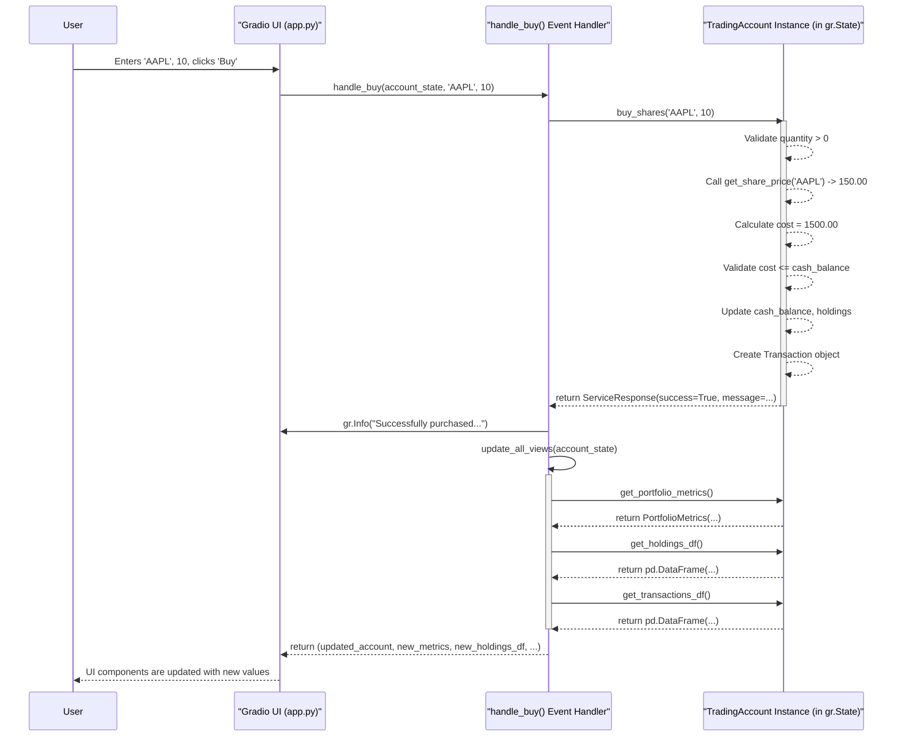

# Technical Design Document: Trading Simulation Platform

**Version**: 1.0
**Date**: 2023-10-27
**Author**: Engineering Lead - Python Backend & Gradio Frontend Architect

---

## 1. Overview & Architecture

This document provides a comprehensive technical design for the "Trading Simulation Platform" epic. The system is architected with a clear separation of concerns between a stateless, pure Python backend engine and a reactive Gradio frontend. This design enables independent development, testing, and maintenance of the business logic and the user interface.

### 1.1. High-Level System Architecture

The architecture consists of two primary components within a single runtime environment:

1.  **Backend (`trading_engine` module)**: A self-contained Python module responsible for all business logic, including account state management, transaction processing, and portfolio calculations. It exposes a clean API and has no knowledge of the Gradio frontend.
2.  **Frontend (`app.py`)**: A Gradio application that handles all user interaction. It instantiates the backend `TradingAccount` class, stores its instance in `gr.State`, and calls its methods in response to user events. It is responsible for rendering data and displaying user-facing messages returned by the backend.

```mermaid
graph TD
    subgraph "Gradio Frontend (app.py)"
        UI_Components[Gradio UI Components: Tabs, Buttons, DataFrames]
        Event_Handlers[Event Handlers (Python Functions)]
        Gradio_State[gr.State(TradingAccount instance)]
    end

    subgraph "Python Backend (trading_engine)"
        Account_Class[TradingAccount Class]
        Data_Models[Pydantic Models: Transaction, PortfolioMetrics]
        Exceptions[Custom Exceptions]
        Market_Data[Market Data Mock]
    end

    User -- Interacts with --> UI_Components
    UI_Components -- Triggers --> Event_Handlers
    Event_Handlers -- Reads/Updates --> Gradio_State
    Event_Handlers -- Calls Methods on --> Account_Class
    Account_Class -- Uses --> Data_Models
    Account_Class -- Raises --> Exceptions
    Account_Class -- Calls --> Market_Data
    Account_Class -- Returns Structured Response --> Event_Handlers
    Event_Handlers -- Updates --> UI_Components
```

### 1.2. Technology Stack

*   **Python**: 3.9+
*   **Backend Core**: Standard Library, Pydantic (for data modeling), `decimal` for precision.
*   **Frontend**: Gradio 4.x
*   **Testing**: Pytest
*   **Code Formatting**: Black, Ruff

### 1.3. Module Organization & File Structure

```
trading-simulation/
├── trading_engine/
│   ├── __init__.py
│   ├── account.py         # Contains the core TradingAccount class and business logic.
│   ├── models.py          # Pydantic data models (Transaction, etc.) and Enums.
│   ├── exceptions.py      # Custom exception classes for business logic errors.
│   └── market_data.py     # Mock get_share_price function.
├── tests/
│   ├── __init__.py
│   ├── conftest.py        # Pytest fixtures.
│   └── test_account.py    # Unit tests for the TradingAccount class.
├── app.py                 # The main Gradio application file.
└── requirements.txt       # Project dependencies.
```

### 1.4. Design Principles

*   **Separation of Concerns**: The backend (`trading_engine`) is completely decoupled from the frontend (`app.py`). The backend handles *what* the application does, while the frontend handles *how* it's presented.
*   **Single Source of Truth**: The `TradingAccount` instance, held within `gr.State`, is the single, authoritative source of the user's portfolio state.
*   **Atomic Transactions**: Backend methods validate all conditions before modifying the account state. On failure, the state remains unchanged, ensuring data consistency.
*   **Clear Contracts**: The backend communicates with the frontend via a standardized `ServiceResponse` object, providing a clear and type-safe contract for success/error handling and data payloads.

---

## 2. Python Backend Design (`trading_engine` module)

The backend is designed as a reusable, testable library for managing a trading account, with no dependencies on Gradio.

### 2.1. Data Models/Schemas (`models.py`)

Pydantic models ensure type safety, validation, and clear data contracts. We use `Decimal` for all financial calculations to prevent floating-point inaccuracies.

```python
# trading_engine/models.py
from datetime import datetime
from decimal import Decimal
from enum import Enum
from typing import Dict, List, Optional, Union

from pydantic import BaseModel, Field

class TransactionType(str, Enum):
    INITIALIZE = "INITIALIZE"
    DEPOSIT = "DEPOSIT"
    WITHDRAW = "WITHDRAW"
    BUY = "BUY"
    SELL = "SELL"

class Transaction(BaseModel):
    """Represents a single financial transaction in the account history."""
    timestamp: datetime = Field(default_factory=datetime.utcnow)
    type: TransactionType
    symbol: Optional[str] = None
    quantity: Optional[int] = None
    price_per_share: Optional[Decimal] = None
    total_value: Decimal

class PortfolioMetrics(BaseModel):
    """A snapshot of key performance indicators for the portfolio."""
    cash_balance: Decimal
    total_holdings_value: Decimal
    total_portfolio_value: Decimal
    profit_loss: Decimal

class ServiceResponse(BaseModel):
    """A standardized response object for all service layer methods."""
    success: bool
    message: str
    data: Optional[Union[PortfolioMetrics, Transaction]] = None
```

### 2.2. Error Handling Strategy (`exceptions.py`)

A hierarchy of custom exceptions allows for specific business rule violations to be caught and handled gracefully.

```python
# trading_engine/exceptions.py
class TradingError(Exception):
    """Base exception for all trading engine errors."""
    pass

class InsufficientFundsError(TradingError):
    """Raised when an operation cannot be completed due to lack of cash."""
    pass

class InsufficientHoldingsError(TradingError):
    """Raised when trying to sell more shares than owned."""
    pass

class InvalidSymbolError(TradingError):
    """Raised when a stock symbol is not found or invalid."""
    pass

class InvalidAmountError(TradingError):
    """Raised for non-positive or otherwise invalid transaction amounts."""
    pass
```

### 2.3. Market Data Provider (`market_data.py`)

A mock implementation as specified in the business requirements. This can be replaced with a real API call in the future without changing the `TradingAccount` class's interface.

```python
# trading_engine/market_data.py
from decimal import Decimal
from .exceptions import InvalidSymbolError

_mock_prices = {
    "AAPL": Decimal("150.00"),
    "TSLA": Decimal("200.00"),
    "GOOGL": Decimal("130.00"),
}

def get_share_price(symbol: str) -> Decimal:
    """
    Retrieves the current price for a given stock symbol.

    Args:
        symbol: The stock ticker symbol (e.g., 'AAPL').

    Raises:
        InvalidSymbolError: If the symbol is not found in the mock data.

    Returns:
        The price of the share as a Decimal object.
    """
    price = _mock_prices.get(symbol.upper())
    if price is None:
        raise InvalidSymbolError(f"Trade failed. Stock symbol '{symbol}' not found.")
    return price
```

### 2.4. Primary Class Definition (`account.py`)

The `TradingAccount` class encapsulates all state and business logic. It never raises exceptions directly to the caller, instead packaging results in a `ServiceResponse` object.

```python
# trading_engine/account.py
import pandas as pd
from datetime import datetime
from decimal import Decimal, ROUND_HALF_UP
from typing import Dict, List

from .models import ServiceResponse, Transaction, TransactionType, PortfolioMetrics
from .exceptions import (
    InsufficientFundsError, InsufficientHoldingsError,
    InvalidAmountError, InvalidSymbolError
)
from .market_data import get_share_price

class TradingAccount:
    """
    Manages the state and operations of a trading simulation account.
    This class is the core of the backend business logic.
    """

    def __init__(self) -> None:
        """Initializes an empty and uninitialized account."""
        self.cash_balance: Decimal = Decimal("0.0")
        self.holdings: Dict[str, int] = {}
        self.transactions: List[Transaction] = []
        self.total_deposits: Decimal = Decimal("0.0")
        self.total_withdrawals: Decimal = Decimal("0.0")
        self.initialized: bool = False

    def initialize(self, deposit_amount: float) -> ServiceResponse:
        """
        Initializes the account with a starting cash balance.

        Args:
            deposit_amount: The initial amount of cash to deposit.

        Returns:
            A ServiceResponse indicating success or failure and a user-friendly message.
        """
        if self.initialized:
            return ServiceResponse(success=False, message="Account already initialized.")
        if not isinstance(deposit_amount, (int, float)) or deposit_amount <= 0:
            return ServiceResponse(
                success=False,
                message="Initial deposit must be a positive number."
            )
        
        amount = Decimal(str(deposit_amount)).quantize(Decimal("0.01"))
        self.cash_balance = amount
        self.total_deposits = amount
        self.initialized = True
        
        tx = Transaction(type=TransactionType.INITIALIZE, total_value=amount)
        self.transactions.append(tx)
        
        return ServiceResponse(
            success=True,
            message=f"Account initialized with a balance of ${amount:,.2f}."
        )

    def deposit(self, amount: float) -> ServiceResponse:
        """Deposits additional cash into the account."""
        try:
            if not isinstance(amount, (int, float)) or amount <= 0:
                raise InvalidAmountError("Amount must be a positive number.")
            
            dec_amount = Decimal(str(amount)).quantize(Decimal("0.01"))
            self.cash_balance += dec_amount
            self.total_deposits += dec_amount
            
            tx = Transaction(type=TransactionType.DEPOSIT, total_value=dec_amount)
            self.transactions.append(tx)
            
            return ServiceResponse(
                success=True,
                message=f"Successfully deposited ${dec_amount:,.2f}."
            )
        except InvalidAmountError as e:
            return ServiceResponse(success=False, message=str(e))

    def withdraw(self, amount: float) -> ServiceResponse:
        """Withdraws cash from the account, checking for sufficient funds."""
        try:
            if not isinstance(amount, (int, float)) or amount <= 0:
                raise InvalidAmountError("Amount must be a positive number.")
                
            dec_amount = Decimal(str(amount)).quantize(Decimal("0.01"))
            if dec_amount > self.cash_balance:
                raise InsufficientFundsError(
                    f"Withdrawal failed. Insufficient funds. Available: ${self.cash_balance:,.2f}."
                )

            self.cash_balance -= dec_amount
            self.total_withdrawals += dec_amount
            
            tx = Transaction(type=TransactionType.WITHDRAW, total_value=-dec_amount)
            self.transactions.append(tx)
            
            return ServiceResponse(
                success=True,
                message=f"Successfully withdrew ${dec_amount:,.2f}."
            )
        except (InvalidAmountError, InsufficientFundsError) as e:
            return ServiceResponse(success=False, message=str(e))

    def buy_shares(self, symbol: str, quantity: int) -> ServiceResponse:
        """Executes a buy order for a given stock."""
        try:
            if not isinstance(quantity, int) or quantity <= 0:
                raise InvalidAmountError("Quantity must be a positive integer.")
            
            price_per_share = get_share_price(symbol)
            total_cost = price_per_share * quantity
            if total_cost > self.cash_balance:
                raise InsufficientFundsError(
                    f"Buy order failed. Insufficient funds. Required: "
                    f"${total_cost:,.2f}, Available: ${self.cash_balance:,.2f}."
                )

            # --- State Modification: Only after all validations pass ---
            self.cash_balance -= total_cost
            self.holdings[symbol] = self.holdings.get(symbol, 0) + quantity
            
            tx = Transaction(
                type=TransactionType.BUY,
                symbol=symbol,
                quantity=quantity,
                price_per_share=price_per_share,
                total_value=-total_cost,
            )
            self.transactions.append(tx)
            
            return ServiceResponse(
                success=True,
                message=f"Successfully purchased {quantity} shares of {symbol} for ${total_cost:,.2f}."
            )
        except (InvalidSymbolError, InvalidAmountError, InsufficientFundsError) as e:
            return ServiceResponse(success=False, message=str(e))

    def sell_shares(self, symbol: str, quantity: int) -> ServiceResponse:
        """Executes a sell order for a given stock."""
        try:
            if not isinstance(quantity, int) or quantity <= 0:
                raise InvalidAmountError("Quantity must be a positive integer.")

            current_holding = self.holdings.get(symbol, 0)
            if quantity > current_holding:
                raise InsufficientHoldingsError(
                    f"Sell order failed. You cannot sell {quantity} shares of {symbol}. You only own {current_holding}."
                )

            price_per_share = get_share_price(symbol)
            total_proceeds = price_per_share * quantity

            # --- State Modification: Only after all validations pass ---
            self.cash_balance += total_proceeds
            self.holdings[symbol] -= quantity
            if self.holdings[symbol] == 0:
                del self.holdings[symbol]

            tx = Transaction(
                type=TransactionType.SELL,
                symbol=symbol,
                quantity=quantity,
                price_per_share=price_per_share,
                total_value=total_proceeds,
            )
            self.transactions.append(tx)
            
            return ServiceResponse(
                success=True,
                message=f"Successfully sold {quantity} shares of {symbol} for ${total_proceeds:,.2f}."
            )
        except (InvalidSymbolError, InvalidAmountError, InsufficientHoldingsError) as e:
            return ServiceResponse(success=False, message=str(e))

    def get_portfolio_metrics(self) -> PortfolioMetrics:
        """Calculates and returns key portfolio metrics."""
        total_holdings_value = Decimal("0.0")
        for symbol, quantity in self.holdings.items():
            try:
                price = get_share_price(symbol)
                total_holdings_value += price * quantity
            except InvalidSymbolError:
                # For this simulation, we assume prices are always available for owned stocks.
                pass
        
        total_portfolio_value = self.cash_balance + total_holdings_value
        profit_loss = total_portfolio_value - self.total_deposits + self.total_withdrawals
        
        return PortfolioMetrics(
            cash_balance=self.cash_balance.quantize(Decimal("0.01")),
            total_holdings_value=total_holdings_value.quantize(Decimal("0.01")),
            total_portfolio_value=total_portfolio_value.quantize(Decimal("0.01")),
            profit_loss=profit_loss.quantize(Decimal("0.01")),
        )

    def get_holdings_df(self) -> pd.DataFrame:
        """Returns current holdings as a Pandas DataFrame formatted for UI display."""
        data = []
        for symbol, quantity in sorted(self.holdings.items()):
            price = get_share_price(symbol)
            market_value = price * quantity
            data.append({
                "Symbol": symbol,
                "Quantity": quantity,
                "Current Price": f"${price:,.2f}",
                "Market Value": f"${market_value:,.2f}",
            })
        
        if not data:
            return pd.DataFrame(columns=["Symbol", "Quantity", "Current Price", "Market Value"])
        return pd.DataFrame(data)

    def get_transactions_df(self) -> pd.DataFrame:
        """Returns transaction history as a Pandas DataFrame formatted for UI display."""
        data = []
        for tx in reversed(self.transactions):
            data.append({
                "Timestamp": tx.timestamp.strftime("%Y-%m-%d %H:%M:%S"),
                "Type": tx.type.value,
                "Symbol": tx.symbol or "N/A",
                "Quantity": tx.quantity or "N/A",
                "Price/Share": f"${tx.price_per_share:,.2f}" if tx.price_per_share else "N/A",
                "Total Value": f"{'+' if tx.total_value > 0 else ''}${tx.total_value:,.2f}",
            })

        if not data:
            return pd.DataFrame(columns=["Timestamp", "Type", "Symbol", "Quantity", "Price/Share", "Total Value"])
        return pd.DataFrame(data)
```

---

## 3. Gradio Frontend Design (`app.py`)

The frontend is a single script that orchestrates the UI and interactions, driven entirely by the state of the backend `TradingAccount` object.

### 3.1. UI Component Mapping

| User Story | Backend Method             | Gradio Components                                                                                                   | Event          |
| :--------- | :------------------------- | :------------------------------------------------------------------------------------------------------------------ | :------------- |
| US-001     | `initialize()`             | `gr.Number(label="Initial Deposit")`, `gr.Button("Start Simulation")`                                                 | `click`        |
| US-001     | `get_portfolio_metrics()`  | `gr.Number(label="Total Portfolio Value")`, `gr.Number(label="Profit / Loss")`, `gr.Number(label="Cash Balance")`   | `click` (init) & any successful state change |
| US-001     | `get_holdings_df()`        | `gr.DataFrame(headers=...)`                                                                               | `click` (init) & any successful state change |
| US-002     | `deposit()`                | `gr.Number(label="Amount")`, `gr.Button("Deposit")`                                                                   | `click`        |
| US-002     | `withdraw()`               | `gr.Number(label="Amount")`, `gr.Button("Withdraw")`                                                                  | `click`        |
| US-003     | `buy_shares()`             | `gr.Dropdown(...)`, `gr.Number(label="Quantity")`, `gr.Button("Buy")`                                                 | `click`        |
| US-003     | `sell_shares()`            | `gr.Dropdown(...)`, `gr.Number(label="Quantity")`, `gr.Button("Sell")`                                                | `click`        |
| US-004     | `get_transactions_df()`    | `gr.DataFrame(headers=...)`                                                                            | `click` (init) & any successful state change |

### 3.2. User-Facing Messages

All messages are generated by the backend's `ServiceResponse.message` and displayed in the frontend using the appropriate Gradio notification.

| Message Text                                                               | Gradio Component | Triggering Story / Scenario                                   |
| :------------------------------------------------------------------------- | :--------------- | :------------------------------------------------------------ |
| "Account initialized with a balance of $100,000.00."                       | `gr.Info`        | US-001: Successful initialization                           |
| "Initial deposit must be a positive number."                               | `gr.Error`       | US-001: Non-positive initial deposit                        |
| "Successfully deposited $5,000.00."                                        | `gr.Info`        | US-002: Successful deposit                                  |
| "Successfully withdrew $2,000.00."                                         | `gr.Info`        | US-002: Successful withdrawal                               |
| "Withdrawal failed. Insufficient funds. Available: $10,000.00."            | `gr.Error`       | US-002: Attempt to overdraw                                 |
| "Amount must be a positive number."                                        | `gr.Error`       | US-002: Non-positive deposit/withdrawal                     |
| "Successfully purchased 10 shares of AAPL for $1,500.00."                  | `gr.Info`        | US-003: Successful buy order                                |
| "Successfully sold 20 shares of TSLA for $4,000.00."                       | `gr.Info`        | US-003: Successful sell order                               |
| "Buy order failed. Insufficient funds. Required: $1,500.00, Available: $1,000.00." | `gr.Error`       | US-003: Buy order with insufficient funds                   |
| "Sell order failed. You cannot sell 60 shares of TSLA. You only own 50."   | `gr.Error`       | US-003: Attempt to sell more shares than owned              |
| "Trade failed. Stock symbol 'FAKE' not found."                             | `gr.Error`       | US-003: Trade attempt with an invalid stock symbol          |
| "Please select a symbol and enter a quantity."                             | `gr.Warning`     | Frontend validation for empty trade inputs                  |

### 3.3. UI Layout & Workflow

The UI will be built with `gr.Blocks`. State transitions (e.g., hiding the setup group and showing the main dashboard) will be handled by returning updated `gr.Group(visible=...)` and `gr.Tab(interactive=...)` components from the `handle_initialize` event handler. All other successful transactions will trigger a refresh of all data-display components.

### 3.4. State Management and Event Handling Pattern

1.  A single instance of `TradingAccount` is stored in `gr.State(TradingAccount())`.
2.  All event handler functions take `account_state` as their first input.
3.  The handler calls the appropriate method on the `account_state` object.
4.  The handler checks the returned `ServiceResponse`:
    *   If `success` is `True`, it shows a `gr.Info` message. It then calls a shared `update_all_views` function to get fresh dataframes and metrics.
    *   If `success` is `False`, it shows a `gr.Error` message.
5.  The handler returns a tuple containing the (potentially updated) `account_state` as the first element, followed by updates for all other relevant UI components.

---

## 4. Integration Points

### 4.1. Backend-Frontend Communication

Communication is synchronous and direct. A Gradio event handler calls a method on the `TradingAccount` instance. The method blocks until it completes and returns a `ServiceResponse` object. This simple pattern is effective and meets the specified performance NFRs.

### 4.2. Data Flow Diagram: Successful "Buy" Transaction



---

## 5. Implementation Examples

### 5.1. Backend Unit Test Example (`tests/test_account.py` with fixture)

```python
# tests/conftest.py
import pytest
from decimal import Decimal
from trading_engine.account import TradingAccount

@pytest.fixture
def initialized_account() -> TradingAccount:
    """Provides a TradingAccount instance initialized with $10,000."""
    account = TradingAccount()
    account.initialize(10000.0)
    return account

# tests/test_account.py
import pytest
from decimal import Decimal
from trading_engine.account import TradingAccount

def test_withdraw_insufficient_funds(initialized_account: TradingAccount):
    """Verify that withdrawing more than available cash fails and state is unchanged."""
    initial_cash = initialized_account.cash_balance
    response = initialized_account.withdraw(10000.01)

    assert not response.success
    assert "Insufficient funds" in response.message
    assert initialized_account.cash_balance == initial_cash # State unchanged

def test_buy_shares_success(initialized_account: TradingAccount):
    """Verify a successful purchase updates cash, holdings, and transactions."""
    # get_share_price("AAPL") -> 150.00
    response = initialized_account.buy_shares("AAPL", 10)

    assert response.success
    assert "Successfully purchased" in response.message
    assert initialized_account.cash_balance == Decimal("8500.00") # 10000 - (10 * 150)
    assert initialized_account.holdings["AAPL"] == 10
    assert len(initialized_account.transactions) == 2 # Initialize + Buy
```

### 5.2. Frontend Integration Example (`app.py`)

This is a runnable skeleton demonstrating the complete integration pattern.

```python
# app.py
import gradio as gr
import pandas as pd
from trading_engine.account import TradingAccount

STOCK_CHOICES = ["AAPL", "TSLA", "GOOGL"]

def update_all_views(account: TradingAccount):
    """Helper to get fresh data and return it in a tuple for UI updates."""
    if not account.initialized:
        return (gr.update(), gr.update(), gr.update(), gr.update(), gr.update())
        
    metrics = account.get_portfolio_metrics()
    holdings_df = account.get_holdings_df()
    transactions_df = account.get_transactions_df()
    
    return (
        f"${metrics.total_portfolio_value:,.2f}",
        f"${metrics.profit_loss:,.2f}",
        f"${metrics.cash_balance:,.2f}",
        holdings_df,
        transactions_df,
    )

def handle_initialize(account: TradingAccount, initial_deposit: float):
    response = account.initialize(initial_deposit)
    
    if response.success:
        gr.Info(response.message)
        visibility_updates = (
            gr.update(visible=False), gr.update(visible=True)
        )
        tab_updates = (
            gr.update(interactive=True), gr.update(interactive=True), gr.update(interactive=True)
        )
        dashboard_updates = update_all_views(account)
        return (account, *visibility_updates, *tab_updates, *dashboard_updates)
    else:
        gr.Error(response.message)
        return (account, gr.update(), gr.update(), gr.update(), gr.update(), gr.update(), gr.update(), gr.update(), gr.update(), gr.update(), gr.update())

def create_generic_handler(action_func):
    """Factory to create handlers for deposit, withdraw, buy, sell."""
    def handler(account: TradingAccount, *args):
        response = action_func(account, *args)
        if response.success:
            gr.Info(response.message)
        else:
            gr.Error(response.message)
        
        dashboard_updates = update_all_views(account)
        return (account, *dashboard_updates)
    return handler

def create_ui():
    with gr.Blocks(title="Trading Simulation Platform", theme=gr.themes.Soft()) as demo:
        account_state = gr.State(value_factory=TradingAccount)
        
        with gr.Tabs() as tabs:
            with gr.Tab("Portfolio", id=0) as portfolio_tab:
                with gr.Group(visible=True, elem_id="initial_setup_group") as setup_group:
                    with gr.Row():
                        initial_deposit = gr.Number(label="Initial Deposit", value=100000, minimum=0.01)
                        start_btn = gr.Button("Start Simulation", variant="primary", scale=0)
                with gr.Group(visible=False, elem_id="portfolio_overview_group") as overview_group:
                    gr.Markdown("### Key Metrics")
                    with gr.Row():
                        portfolio_val = gr.Textbox(label="Total Portfolio Value", interactive=False)
                        pnl = gr.Textbox(label="Profit / Loss", interactive=False)
                        cash_bal = gr.Textbox(label="Cash Balance", interactive=False)
                    gr.Markdown("### Current Holdings")
                    holdings_df = gr.DataFrame(headers=["Symbol", "Quantity", "Current Price", "Market Value"], interactive=False, height=200)

            with gr.Tab("Trade", id=1, interactive=False) as trade_tab:
                with gr.Row():
                    trade_symbol = gr.Dropdown(STOCK_CHOICES, label="Symbol")
                    trade_qty = gr.Number(label="Quantity", minimum=1, step=1, precision=0)
                with gr.Row():
                    buy_btn = gr.Button("Buy", variant="primary")
                    sell_btn = gr.Button("Sell", variant="stop")

            with gr.Tab("Cash Management", id=2, interactive=False) as cash_tab:
                with gr.Row():
                    with gr.Column():
                        gr.Markdown("### Deposit Funds")
                        deposit_amt = gr.Number(label="Amount", minimum=0.01)
                        deposit_btn = gr.Button("Deposit", variant="primary")
                    with gr.Column():
                        gr.Markdown("### Withdraw Funds")
                        withdraw_amt = gr.Number(label="Amount", minimum=0.01)
                        withdraw_btn = gr.Button("Withdraw", variant="stop")

            with gr.Tab("Transaction History", id=3, interactive=False) as history_tab:
                gr.Markdown("## Transaction History")
                transactions_df = gr.DataFrame(headers=["Timestamp", "Type", "Symbol", "Quantity", "Price/Share", "Total Value"], interactive=False, height=400)

        # --- Event Handling ---
        dashboard_outputs = [portfolio_val, pnl, cash_bal, holdings_df, transactions_df]
        
        start_btn.click(
            fn=handle_initialize,
            inputs=[account_state, initial_deposit],
            outputs=[account_state, setup_group, overview_group, trade_tab, cash_tab, history_tab, *dashboard_outputs]
        )
        
        buy_btn.click(
            fn=create_generic_handler(lambda acc, sym, qty: acc.buy_shares(sym, qty)),
            inputs=[account_state, trade_symbol, trade_qty],
            outputs=[account_state, *dashboard_outputs]
        )
        sell_btn.click(
            fn=create_generic_handler(lambda acc, sym, qty: acc.sell_shares(sym, qty)),
            inputs=[account_state, trade_symbol, trade_qty],
            outputs=[account_state, *dashboard_outputs]
        )
        deposit_btn.click(
            fn=create_generic_handler(lambda acc, amt: acc.deposit(amt)),
            inputs=[account_state, deposit_amt],
            outputs=[account_state, *dashboard_outputs]
        )
        withdraw_btn.click(
            fn=create_generic_handler(lambda acc, amt: acc.withdraw(amt)),
            inputs=[account_state, withdraw_amt],
            outputs=[account_state, *dashboard_outputs]
        )
    return demo

if __name__ == "__main__":
    app = create_ui()
    app.launch()
```

---

## 6. Testing & QA Guidelines

### 6.1. Backend Testing

*   **Unit Tests**: The `trading_engine` module MUST have a unit test for every distinct business rule and calculation.
*   **Strategy**: Use `pytest`. Test every public method of `TradingAccount`. Each test should cover one specific scenario (e.g., `test_buy_with_exact_funds`, `test_sell_all_shares`, `test_deposit_invalid_type`).
*   **Fixtures**: Use pytest fixtures to create pre-configured `TradingAccount` instances (e.g., `empty_account`, `initialized_account`, `account_with_holdings`).
*   **Assertions**: Assert both the content of the `ServiceResponse` and the resulting state of the `TradingAccount` instance. Crucially, verify that state does *not* change on failure.
*   **Coverage**: Aim for >=95% line coverage for the `trading_engine` module.

### 6.2. Frontend & Integration Testing

*   **Strategy**: QA will perform manual end-to-end testing following the acceptance criteria of each user story. The application should be run locally via `python app.py`.
*   **QA Validation Points**:
    1.  **US-001**: Verify initial setup UI hides and dashboard appears on successful initialization. Check all initial metric values are correct and tabs become interactive. Test non-positive deposit error.
    2.  **US-002**: Test successful deposit/withdrawal, confirming cash balance updates on the Portfolio tab. Test insufficient funds error and non-positive amount error.
    3.  **US-003**: Test successful buy/sell, confirming both cash and holdings update correctly. Test insufficient funds, insufficient holdings, and invalid symbol errors.
    4.  **US-004**: After performing a sequence of all transaction types, navigate to the History tab and verify all transactions are present, correctly formatted, and in reverse chronological order.
*   **Performance**: All UI updates after a button click must complete in under 200ms.
*   **Accessibility**: Manual testing using keyboard navigation (Tab, Shift+Tab, Enter, Space) and a screen reader (e.g., NVDA, VoiceOver) to ensure all interactive elements are reachable, labeled, and operable.

---

## 7. Dependencies & Setup

### 7.1. Required Packages (`requirements.txt`)

```
gradio==4.10.0
pydantic==2.6.4
pandas==2.2.1

# Development/Testing
pytest==8.1.1
black==24.3.0
ruff==0.3.5
```

### 7.2. Development Environment Setup

1.  Clone the repository.
2.  Create and activate a Python virtual environment:
    ```bash
    python -m venv venv
    source venv/bin/activate  # On Windows: venv\Scripts\activate
    ```
3.  Install dependencies: `pip install -r requirements.txt`
4.  Format code: `black .` and `ruff check --fix .`
5.  Run unit tests: `pytest`
6.  Launch the application: `python app.py`

---

## 8. Definition of Done

*   [ ] All backend code resides in the `trading_engine` module; all frontend code resides in `app.py`.
*   [ ] The `TradingAccount` class and all its methods are fully implemented with docstrings and type hints as specified.
*   [ ] Pydantic models are used for all data structures.
*   [ ] All custom exceptions are defined and handled internally by `TradingAccount` methods.
*   [ ] Unit tests for `trading_engine` achieve >=95% line coverage.
*   [ ] Gradio UI is implemented as per the wireframes and component specifications.
*   [ ] All event handlers are implemented and correctly update the UI and `gr.State`.
*   [ ] All user-facing messages from the user stories are implemented via `ServiceResponse` and displayed with `gr.Info`/`gr.Error`.
*   [ ] All acceptance criteria for US-001, US-002, US-003, and US-004 have been manually verified by QA and have passed.
*   [ ] The application meets the specified performance (<200ms interaction time) and accessibility (WCAG 2.1 AA) NFRs.
*   [ ] Code has been peer-reviewed and merged to the main branch.