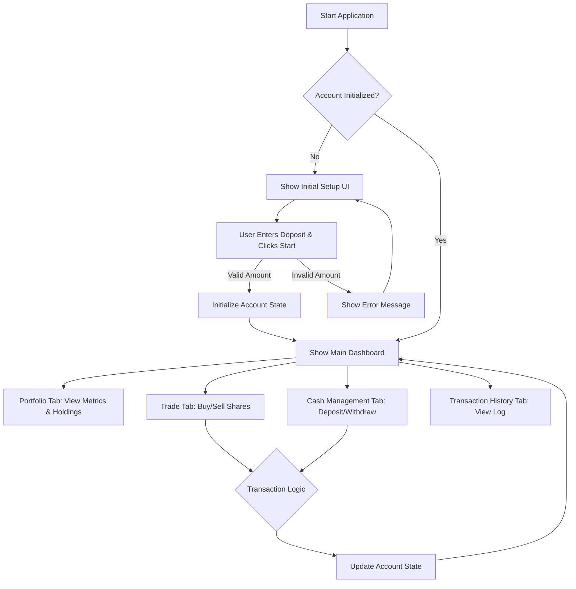

### **Comprehensive User Stories Document: Trading Simulation Platform**

### **Feature Summary: Account & Portfolio Management**

-   **Epic**: E-01: Core Trading Simulation
-   **Description**: This epic covers the foundational features for a single-user trading simulation application. The goal is to provide a user with the ability to initialize a virtual trading account, manage their cash balance, execute market orders for a predefined set of stocks, and monitor their portfolio performance and transaction history. The user interface will be built using the Gradio framework for rapid development and a clear, functional layout.
-   **User Persona**: Trader - An individual using the platform to simulate stock trading, learn market dynamics, and test investment strategies without financial risk.

### **User Flow Diagram**



### **High-Level Non-Functional Requirements (NFRs)**

-   **Performance**: All UI interactions and calculations (e.g., portfolio value update) must complete in under 200ms. Calls to `get_share_price()` should not block the UI for more than 1 second.
-   **Usability**: The interface must be intuitive. All primary actions (viewing portfolio, executing a trade, managing cash) must be accessible from the main tabbed interface without complex navigation.
-   **Reliability**: The internal state of the user's account (cash, holdings, transaction list) must remain consistent and accurate after every operation. Calculations for portfolio value and P/L must be precise to two decimal places.
-   **Accessibility**: The application must adhere to WCAG 2.1 Level AA guidelines. All interactive elements must be clearly labeled, keyboard-navigable, and compatible with screen readers.
-   **Compatibility**: The Gradio application must render and function correctly on the latest stable versions of Chrome, Firefox, and Safari.

---

### **US-001: Initialize Account and View Portfolio Dashboard**

-   **Story ID**: US-001
-   **Title**: Initialize Account and View Portfolio Dashboard
-   **User Story**: As a Trader, I want to set an initial account balance and view a dashboard of my key portfolio metrics, so that I have a starting point for my simulation and can track my performance at a glance.
-   **Business Value**: Establishes the core user interface and provides the foundational state for all subsequent trading activities. It is the mandatory first step for user engagement.
-   **Priority**: High
-   **Story Points Estimation Guidance**: Medium (3 points). Involves setting up the main UI structure, conditional UI visibility, state management, and initial data display components.

#### **Acceptance Criteria**

1.  **Scenario: Initializing the account successfully**
    -   **Given** I am a new user launching the application.
    -   **When** I provide an initial deposit amount of "100000" and click "Start Simulation".
    -   **Then** the "Initial Setup" section should become hidden.
    -   **And** the "Portfolio Overview" section should become visible.
    -   **And** the "Cash Balance" metric should display "$100,000.00".
    -   **And** the "Total Portfolio Value" metric should display "$100,000.00".
    -   **And** the "Profit / Loss" metric should display "$0.00".
    -   **And** the "Current Holdings" table should be empty.
    -   **And** I should see an information message: "Account initialized with a balance of $100,000.00."
    -   **And** the "Trade", "Cash Management", and "Transaction History" tabs should become enabled.

2.  **Scenario: Attempting to initialize with a non-positive amount**
    -   **Given** I am a new user launching the application.
    -   **When** I enter "0" into the initial deposit field and click "Start Simulation".
    -   **Then** the account state should not change, and the "Initial Setup" UI remains.
    -   **And** I should see an error message: "Initial deposit must be a positive number."

3.  **Scenario: Viewing the dynamic dashboard**
    -   **Given** I have an active account with a cash balance of $5,000, and I own 100 shares of AAPL.
    -   **And** the current price of AAPL is $150.00.
    -   **When** I view the "Portfolio" tab.
    -   **Then** the "Cash Balance" metric should display "$5,000.00".
    -   **And** the "Total Portfolio Value" should be calculated and displayed as "$20,000.00" (5000 cash + 100 * 150 stock value).
    -   **And** the "Current Holdings" table should display one row for "AAPL" with columns: "Symbol": "AAPL", "Quantity": 100, "Current Price": "$150.00", and "Market Value": "$15,000.00".

#### **UI/UX Specifications**

-   **Wireframe / Layout**:
    ```
    +-------------------------------------------------------------------+
    | Trading Simulation Platform                                       |
    +-------------------------------------------------------------------+
    | [ Portfolio ] [ Trade ] [ Cash Management ] [ Transaction History ] | (Other tabs disabled initially)
    +-------------------------------------------------------------------+
    |                                                                   |
    |  ## Initial Setup (Visible only before initialization)            |
    |  +---------------------------------------------------------------+ |
    |  | Initial Deposit: [   100000    ] [ Start Simulation ]          | |
    |  +---------------------------------------------------------------+ |
    |                                                                   |
    |  ## Portfolio Overview (Visible after initialization)             |
    |  +---------------------------------------------------------------+ |
    |  | ### Key Metrics                                               | |
    |  | +-----------------+------------------+------------------+      | |
    |  | | Portfolio Value | Profit / Loss    | Cash Balance     |      | |
    |  | | [ $100,000.00 ] | [ $0.00 ]        | [ $100,000.00 ]  |      | |
    |  | +-----------------+------------------+------------------+      | |
    |  | ### Current Holdings                                          | |
    |  | +-----------------------------------------------------------+ | |
    |  | | Symbol | Quantity | Current Price | Market Value          | | |
    |  | |--------|----------|---------------|-----------------------| | |
    |  | | (No holdings yet)                                         | | |
    |  | +-----------------------------------------------------------+ | |
    |  +---------------------------------------------------------------+ |
    | [ Status messages appear here via gr.Info, gr.Warning, gr.Error ] |
    +-------------------------------------------------------------------+
    ```

-   **Gradio Components**:
    -   `gr.Blocks()` as the main container.
    -   `gr.Tabs()` containing four `gr.Tab()` components. The last three should have `interactive=False` initially.
    -   **Portfolio Tab**:
        -   `gr.Group(visible=True, elem_id="initial_setup_group")`:
            -   `gr.Number(label="Initial Deposit", minimum=0.01)`
            -   `gr.Button("Start Simulation", variant="primary")`
        -   `gr.Group(visible=False, elem_id="portfolio_overview_group")`:
            -   `gr.Markdown("### Key Metrics")`
            -   `gr.Row()` containing three `gr.Number` components (read-only, `interactive=False`): `label="Total Portfolio Value"`, `label="Profit / Loss"`, `label="Cash Balance"`.
            -   `gr.Markdown("### Current Holdings")`
            -   `gr.DataFrame(headers=["Symbol", "Quantity", "Current Price", "Market Value"], interactive=False)`
    -   **User Feedback**:
        -   Success: `gr.Info("Account initialized with a balance of $100,000.00.")`
        -   Error: `gr.Error("Initial deposit must be a positive number.")`

#### **Technical Notes**

-   **Data Model - Account**: The application state should manage an 'Account' object with the following structure:
    ```json
    {
      "cash_balance": 100000.00,
      "holdings": { "AAPL": 100, "TSLA": 50 },
      "transactions": [ ... ], // See US-002
      "total_deposits": 100000.00,
      "total_withdrawals": 0.00
    }
    ```
-   A `gr.State` variable `account_initialized` (boolean) will control the visibility of the UI groups and the enabled state of the other tabs.
-   Profit/Loss Calculation: `(Total Portfolio Value) - (Total Deposits) + (Total Withdrawals)`.

#### **Definition of Done**

-   [ ] All Acceptance Criteria are met and have passing automated tests.
-   [ ] UI is implemented as per Gradio specifications, including conditional visibility and tab states.
-   [ ] All specified user feedback messages are implemented and triggered correctly.
-   [ ] Code has been peer-reviewed and merged.

#### **Out of Scope**

-   User authentication or multiple accounts.
-   Persistence of account data between application sessions.
-   Editing the initial deposit after it has been set.

---

### **US-002: Manage Cash Balance**

-   **Story ID**: US-002
-   **Title**: Manage Cash Balance by Depositing and Withdrawing Funds
-   **User Story**: As a Trader, I want to deposit additional funds and withdraw existing funds, so that I can manage my cash balance in the simulation.
-   **Business Value**: Provides core functionality for managing liquid assets, enabling more flexible trading strategies and continued simulation.
-   **Priority**: High
-   **Story Points Estimation Guidance**: Small (2 points). Involves simple state updates with clear validation logic and transaction logging.

#### **Acceptance Criteria**

1.  **Scenario: Successfully depositing funds**
    -   **Given** my current cash balance is $10,000.
    -   **When** I enter "5000" in the deposit field and click "Deposit".
    -   **Then** my cash balance on the Portfolio tab updates to $15,000.
    -   **And** I see a success message: "Successfully deposited $5,000.00."
    -   **And** a "DEPOSIT" transaction for $5,000 is logged for US-004.

2.  **Scenario: Successfully withdrawing funds**
    -   **Given** my current cash balance is $10,000.
    -   **When** I enter "2000" in the withdrawal field and click "Withdraw".
    -   **Then** my cash balance on the Portfolio tab updates to $8,000.
    -   **And** I see a success message: "Successfully withdrew $2,000.00."
    -   **And** a "WITHDRAW" transaction for $2,000 is logged for US-004.

3.  **Scenario: Attempting to withdraw more funds than available**
    -   **Given** my current cash balance is $10,000.
    -   **When** I enter "10001" in the withdrawal field and click "Withdraw".
    -   **Then** my cash balance remains $10,000.
    -   **And** no transaction is logged.
    -   **And** I see an error message: "Withdrawal failed. Insufficient funds. Available: $10,000.00."

4.  **Scenario: Attempting a non-positive transaction**
    -   **Given** I have an active account.
    -   **When** I enter "-50" into the deposit field and click "Deposit".
    -   **Then** my cash balance does not change.
    -   **And** I see an error message: "Amount must be a positive number."

#### **UI/UX Specifications**

-   **Wireframe / Layout**: A "Cash Management" tab.
    ```
    +-------------------------------------------------------------------+
    | [ Portfolio ] [ Trade ] [ Cash Management ] [ Transaction History ] |
    +-------------------------------------------------------------------+
    | ## Cash Management                                                |
    | +---------------------------+  +--------------------------------+ |
    | | ### Deposit Funds         |  | ### Withdraw Funds             | |
    | | Amount: [ 5000 ]          |  | Amount: [ 2000 ]               | |
    | | [       Deposit       ]   |  | [        Withdraw        ]     | |
    | +---------------------------+  +--------------------------------+ |
    | [ Status messages appear here via gr.Info, gr.Warning, gr.Error ] |
    +-------------------------------------------------------------------+
    ```
-   **Gradio Components**:
    -   `gr.Tab(label="Cash Management", interactive=False)` initially.
    -   `gr.Row()` containing two `gr.Column()` elements.
    -   **Deposit Column**: `gr.Markdown("### Deposit Funds")`, `gr.Number(label="Amount", minimum=0.01)`, `gr.Button("Deposit", variant="primary")`.
    -   **Withdrawal Column**: `gr.Markdown("### Withdraw Funds")`, `gr.Number(label="Amount", minimum=0.01)`, `gr.Button("Withdraw", variant="stop")`.
    -   **User Feedback**:
        -   Success (Deposit): `gr.Info("Successfully deposited $5,000.00.")`
        -   Success (Withdraw): `gr.Info("Successfully withdrew $2,000.00.")`
        -   Error (Insufficient Funds): `gr.Error("Withdrawal failed. Insufficient funds. Available: $10,000.00.")`
        -   Error (Validation): `gr.Error("Amount must be a positive number.")`

#### **Technical Notes**

-   **Dependencies**: US-001 (Account State).
-   **Data Model - Transaction**: Each successful action must create a 'Transaction' object to be appended to the account's transaction list.
    ```json
    {
      "timestamp": "2023-10-27 10:30:00",
      "type": "DEPOSIT", // DEPOSIT, WITHDRAW, BUY, SELL
      "symbol": null, // e.g., "AAPL" for trades
      "quantity": null,
      "price_per_share": null,
      "total_value": 5000.00
    }
    ```
-   The `interactive` property of this tab must be programmatically linked to the `account_initialized` state from US-001.

#### **Definition of Done**

-   [ ] All Acceptance Criteria are met and tested.
-   [ ] UI is implemented as specified and is disabled before account initialization.
-   [ ] State changes are correctly reflected in the Portfolio dashboard (US-001).
-   [ ] All specified user feedback messages are implemented.
-   [ ] Transactions are correctly logged in the specified format for US-004.

#### **Out of Scope**

-   Transaction fees or processing delays.
-   Linking to external bank accounts or payment methods.

---

### **US-003: Buy and Sell Shares**

-   **Story ID**: US-003
-   **Title**: Execute Trades by Buying and Selling Shares
-   **User Story**: As a Trader, I want to buy and sell shares of specific stocks, so that I can build and manage my investment portfolio.
-   **Business Value**: This is the primary user activity, enabling the core purpose of the trading simulation.
-   **Priority**: High
-   **Story Points Estimation Guidance**: Medium (3 points). Involves external function calls, state updates for both cash and holdings, and multiple complex validation paths.

#### **Acceptance Criteria**

1.  **Scenario: Successfully buying shares**
    -   **Given** I have a cash balance of $50,000 and the price of "AAPL" is $150.00.
    -   **When** I select symbol "AAPL", enter quantity "10", and click "Buy".
    -   **Then** my cash balance should decrease by $1,500 to $48,500.
    -   **And** my holdings for "AAPL" in the Portfolio tab should show 10 shares.
    -   **And** I should see a success message: "Successfully purchased 10 shares of AAPL for $1,500.00."
    -   **And** a "BUY" transaction should be logged.

2.  **Scenario: Attempting to buy shares with insufficient funds**
    -   **Given** I have a cash balance of $1,000 and the price of "AAPL" is $150.00.
    -   **When** I select symbol "AAPL", enter quantity "10", and click "Buy".
    -   **Then** my cash balance and holdings should not change.
    -   **And** I should see an error message: "Buy order failed. Insufficient funds. Required: $1,500.00, Available: $1,000.00."

3.  **Scenario: Successfully selling owned shares**
    -   **Given** I own 50 shares of "TSLA" and the price is $200.00.
    -   **When** I select symbol "TSLA", enter quantity "20", and click "Sell".
    -   **Then** my cash balance should increase by $4,000.
    -   **And** my holdings for "TSLA" should decrease to 30 shares.
    -   **And** I should see a success message: "Successfully sold 20 shares of TSLA for $4,000.00."
    -   **And** a "SELL" transaction should be logged.

4.  **Scenario: Attempting to sell more shares than owned**
    -   **Given** I own 50 shares of "TSLA".
    -   **When** I select symbol "TSLA", enter quantity "60", and click "Sell".
    -   **Then** my cash balance and holdings should not change.
    -   **And** I should see an error message: "Sell order failed. You cannot sell 60 shares of TSLA. You only own 50."

5.  **Scenario: Attempting to trade an invalid symbol**
    -   **Given** `get_share_price('FAKE')` returns an error or invalid price.
    -   **When** I attempt to "Buy" 10 shares of "FAKE".
    -   **Then** my state should not change.
    -   **And** I should see an error message: "Trade failed. Stock symbol 'FAKE' not found."

#### **UI/UX Specifications**

-   **Wireframe / Layout**: A "Trade" tab.
    ```
    +-------------------------------------------------------------------+
    | [ Portfolio ] [ Trade ] [ Cash Management ] [ Transaction History ] |
    +-------------------------------------------------------------------+
    | ## Trade Execution                                                |
    |                                                                   |
    |  Symbol:   [ AAPL v] (Dropdown with AAPL, TSLA, GOOGL)            |
    |  Quantity: [ 10      ] (Number input, integer only)               |
    |                                                                   |
    |  +---------------------+  +---------------------+                 |
    |  | [        Buy        ]  | [        Sell       ]                 |
    |  +---------------------+  +---------------------+                 |
    | [ Status messages appear here via gr.Info, gr.Warning, gr.Error ] |
    +-------------------------------------------------------------------+
    ```
-   **Gradio Components**:
    -   `gr.Tab(label="Trade", interactive=False)` initially.
    -   `gr.Markdown("## Trade Execution")`
    -   `gr.Dropdown(label="Symbol", choices=["AAPL", "TSLA", "GOOGL"])`
    -   `gr.Number(label="Quantity", minimum=1, step=1, precision=0)`
    -   `gr.Row()` containing `gr.Button("Buy", variant="primary")` and `gr.Button("Sell", variant="stop")`.
    -   **User Feedback**:
        -   Success (Buy): `gr.Info("Successfully purchased 10 shares of AAPL for $1,500.00.")`
        -   Success (Sell): `gr.Info("Successfully sold 20 shares of TSLA for $4,000.00.")`
        -   Error (Funds): `gr.Error("Buy order failed. Insufficient funds. Required: $1,500.00, Available: $1,000.00.")`
        -   Error (Holdings): `gr.Error("Sell order failed. You cannot sell 60 shares of TSLA. You only own 50.")`
        -   Error (Symbol): `gr.Error("Trade failed. Stock symbol 'FAKE' not found.")`

#### **Technical Notes**

-   **Dependencies**: US-001 (Account State).
-   The `interactive` property of this tab must be programmatically linked to the `account_initialized` state.
-   Must call the provided `get_share_price(symbol)` function for every transaction. The implementation must gracefully handle exceptions or invalid returns from this function.
-   All successful trades must be logged per the Transaction data model in US-002.

#### **Definition of Done**

-   [ ] All Acceptance Criteria are met and tested.
-   [ ] UI is implemented as specified and disabled before initialization.
-   [ ] State changes (cash and holdings) are correctly reflected in the Portfolio dashboard (US-001).
-   [ ] All specified user feedback messages are implemented.
-   [ ] Trades are correctly logged for US-004.

#### **Out of Scope**

-   Real-time price updates in the UI (prices are fetched only at the moment of transaction).
-   Complex order types (e.g., limit, stop-loss). Only market orders are supported.
-   Transaction fees, commissions, or market spread.

---

### **US-004: View Transaction History**

-   **Story ID**: US-004
-   **Title**: View a Chronological List of All Transactions
-   **User Story**: As a Trader, I want to view a history of all my transactions, so that I can review my past trading activity and analyze my decisions.
-   **Business Value**: Provides transparency and allows users to analyze their trading patterns, which is essential for learning and strategy refinement.
-   **Priority**: Medium
-   **Story Points Estimation Guidance**: Small (1 point). Primarily a display feature that consumes data generated by other stories.

#### **Acceptance Criteria**

1.  **Scenario: Viewing a populated transaction history**
    -   **Given** I have performed these actions: Initial Deposit ($100k), Buy 10 AAPL, Withdraw $1k.
    -   **When** I navigate to the "Transaction History" tab.
    -   **Then** I should see a table with 3 rows, displaying the transactions in reverse chronological order (Withdrawal first, Deposit last).
    -   **And** the table must include columns: "Timestamp", "Type", "Symbol", "Quantity", "Price/Share", and "Total Value".
    -   **And** the "Withdrawal" row should show Type "WITHDRAW", Total Value "-$1,000.00", and "N/A" for other trade-specific fields.
    -   **And** the "Buy" row should show Type "BUY", Symbol "AAPL", Quantity 10, and the correct price and total value (e.g., "-$1,500.00").
    -   **And** the "Deposit" row should show Type "DEPOSIT" and Total Value "+$100,000.00".

#### **UI/UX Specifications**

-   **Wireframe / Layout**: A "Transaction History" tab.
    ```
    +-------------------------------------------------------------------+
    | [ Portfolio ] [ Trade ] [ Cash Management ] [ Transaction History ] |
    +-------------------------------------------------------------------+
    | ## Transaction History                                            |
    | +---------------------------------------------------------------+ |
    | | Timestamp         | Type     | Symbol | Qty | Price/Share | Total     | |
    | |-------------------|----------|--------|-----|-------------|-----------| |
    | | 2023-10-27 10:34  | WITHDRAW | N/A    | N/A | N/A         | -$1,000.00| |
    | | 2023-10-27 10:32  | BUY      | AAPL   | 10  | $150.00     | -$1,500.00| |
    | | 2023-10-27 10:30  | DEPOSIT  | N/A    | N/A | N/A         |+$100,000.00|
    | +---------------------------------------------------------------+ |
    +-------------------------------------------------------------------+
    ```
-   **Gradio Components**:
    -   `gr.Tab(label="Transaction History", interactive=False)` initially.
    -   `gr.Markdown("## Transaction History")`
    -   `gr.DataFrame(headers=["Timestamp", "Type", "Symbol", "Quantity", "Price/Share", "Total Value"], interactive=False)`.

#### **Technical Notes**

-   **Dependencies**: US-001, US-002, US-003.
-   The `interactive` property must be linked to the `account_initialized` state.
-   The component should be populated from the `transactions` list in the main Account state object. This list should be sorted by timestamp descending before being displayed.

#### **Definition of Done**

-   [ ] All Acceptance Criteria are met and tested.
-   [ ] The UI is implemented as specified and is disabled before initialization.
-   [ ] The history table correctly populates with data from all transaction types.
-   [ ] Transactions are displayed in reverse chronological order.

#### **Out of Scope**

-   Filtering, sorting, or searching the transaction history.
-   Exporting the transaction history to a file (e.g., CSV).
-   Pagination for long transaction histories.