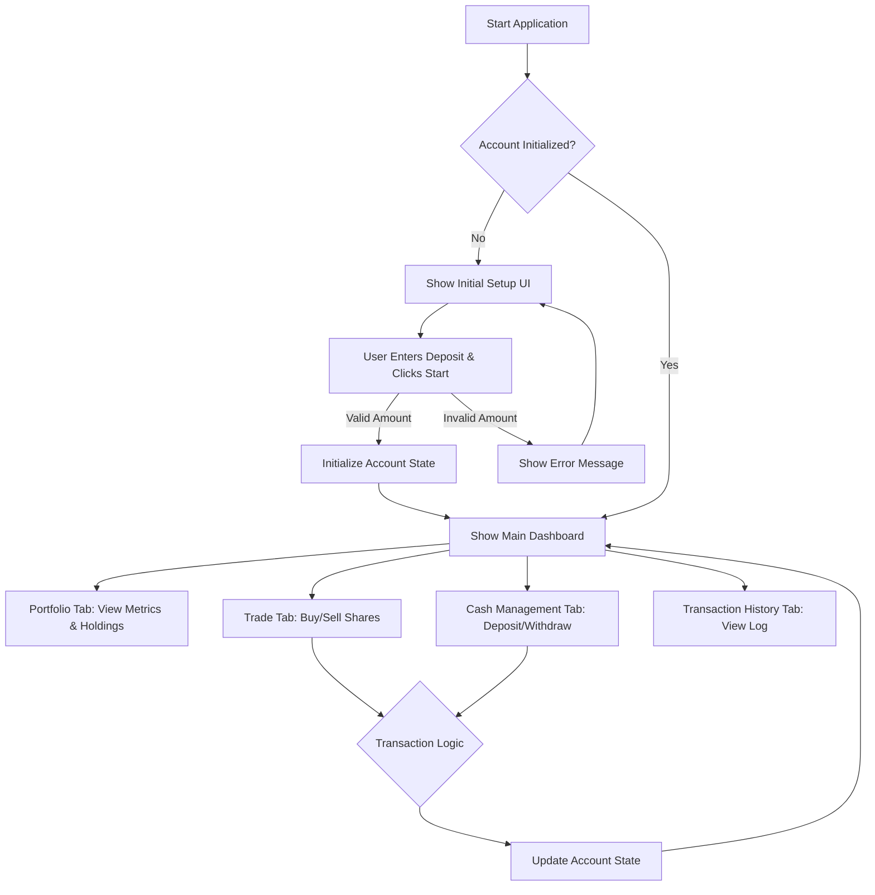

### **Filename**: `/docs/crew/trading_simulation_user_stories.md`

### **Feature Summary: Account & Portfolio Management**

-   **Epic**: E-01: Core Trading Simulation
-   **Description**: This epic covers the foundational features for a single-user trading simulation application. The goal is to provide a user with the ability to initialize a virtual trading account, manage their cash balance, execute market orders for a predefined set of stocks, and monitor their portfolio performance and transaction history. The user interface will be built using the Gradio framework for rapid development and a clear, functional layout.
-   **User Persona**: Trader - An individual using the platform to simulate stock trading, learn market dynamics, and test investment strategies without financial risk.

### **User Flow Diagram**



### **Requirements Traceability Matrix**

| Raw Requirement                                                                                                                                   | Corresponding User Story(ies) |
| :------------------------------------------------------------------------------------------------------------------------------------------------ | :---------------------------- |
| "A simple account management system for a trading simulation platform."                                                                           | E-01 (Epic)                   |
| "The system should allow users to create an account, deposit funds, and withdraw funds."                                                          | US-001, US-002                |
| "The system should allow users to record that they have bought or sold shares, providing a quantity."                                             | US-003                        |
| "The system should calculate the total value of the user's portfolio, and the profit or loss from the initial deposit."                           | US-001                        |
| "The system should be able to report the holdings of the user at any point in time."                                                              | US-001                        |
| "The system should be able to report the profit or loss of the user at any point in time."                                                        | US-001                        |
| "The system should be able to list the transactions that the user has made over time."                                                            | US-004                        |
| "The system should prevent the user from withdrawing funds..., buying more shares than they can afford, or selling shares that they don't have." | US-002, US-003                |
| "The system has access to a function get_share_price(symbol)..."                                                                                  | US-003                        |

### **Definition of Ready**

A user story is considered "Ready" for a development sprint when it meets the following criteria:
-   [x] The user story is clearly defined in the standard format (As a..., I want..., So that...).
-   [x] Acceptance Criteria are written in BDD (Given-When-Then) format and cover happy paths, edge cases, and error handling.
-   [x] All UI/UX specifications, including Gradio components and all user-facing messages, are documented.
-   [x] Dependencies on other stories or external systems are explicitly identified.
-   [x] The story has been reviewed, estimated, and agreed upon by the development team, QA, and the Product Owner.

---

### **US-001: Initialize Account and View Portfolio Dashboard**

-   **Story ID**: US-001
-   **Title**: Initialize Account and View Portfolio Dashboard
-   **User Story**: As a Trader, I want to set an initial account balance and view a dashboard of my key portfolio metrics, so that I have a starting point for my simulation and can track my performance at a glance.
-   **Business Value**: Establishes the core user interface and provides the foundational state for all subsequent trading activities. It is the mandatory first step for user engagement.
-   **Priority**: High
-   **Story Points Estimation Guidance**: Medium (3 points). Involves setting up the main UI structure, conditional UI visibility, state management, and initial data display components.
-   **Dependencies**: None

#### **Acceptance Criteria**

1.  **Scenario: Initializing the account successfully**
    -   **Given** I am a new user launching the application.
    -   **When** I provide an initial deposit amount of "100000" and click "Start Simulation".
    -   **Then** the "Initial Setup" UI group should become hidden.
    -   **And** the "Portfolio Overview" UI group should become visible.
    -   **And** the "Cash Balance" metric should display "$100,000.00".
    -   **And** the "Total Portfolio Value" metric should display "$100,000.00".
    -   **And** the "Profit / Loss" metric should display "$0.00".
    -   **And** I should see an information message: "Account initialized with a balance of $100,000.00."
    -   **And** the "Trade", "Cash Management", and "Transaction History" tabs should become enabled.

2.  **Scenario: Attempting to initialize with a non-positive amount**
    -   **Given** I am a new user launching the application.
    -   **When** I enter "0" into the initial deposit field and click "Start Simulation".
    -   **Then** the account state should not change, and the "Initial Setup" UI remains visible.
    -   **And** I should see an error message: "Initial deposit must be a positive number."

3.  **Scenario: Viewing the dynamic dashboard after trading**
    -   **Given** I have an active account with $5,000 cash and own 100 shares of AAPL, and the current price of AAPL is $150.00.
    -   **When** I view the "Portfolio" tab.
    -   **Then** the "Cash Balance" metric must display "$5,000.00".
    -   **And** the "Total Portfolio Value" must be calculated and displayed as "$20,000.00".
    -   **And** the "Current Holdings" table must display one row for "AAPL" with columns: "Symbol": "AAPL", "Quantity": 100, "Current Price": "$150.00", and "Market Value": "$15,000.00".

#### **UI/UX Specifications**

-   **Wireframe / Layout**:
    ```mermaid
    graph TD
        subgraph Main App Interface
            direction TB
            A[Tabs: Portfolio | Trade (disabled) | Cash Mgt (disabled) | History (disabled)] --> B
            subgraph B[Portfolio Tab]
                direction TB
                C["Initial Setup Group (Visible)"]
                C --> D["gr.Number: Initial Deposit"]
                C --> E["gr.Button: Start Simulation"]
                F["Portfolio Overview Group (Hidden)"]
                F --> G["gr.Row: Portfolio Value | Profit/Loss | Cash Balance"]
                F --> H["gr.DataFrame: Current Holdings"]
            end
            I["Status Message Area"]
            B --> I
        end
    ```

-   **Gradio Components**:
    -   `gr.Tabs()` containing four `gr.Tab()` components. The last three (`Trade`, `Cash Management`, `Transaction History`) must have `interactive=False` initially.
    -   **Portfolio Tab**:
        -   `gr.Group(visible=True)` for Initial Setup:
            -   `gr.Number(label="Initial Deposit", minimum=0.01)`
            -   `gr.Button("Start Simulation", variant="primary")`
        -   `gr.Group(visible=False)` for Portfolio Overview:
            -   `gr.Markdown("### Key Metrics")`
            -   `gr.Row()` containing three `gr.Number` components (read-only, `interactive=False`): `label="Total Portfolio Value"`, `label="Profit / Loss"`, `label="Cash Balance"`.
            -   `gr.Markdown("### Current Holdings")`
            -   `gr.DataFrame(headers=["Symbol", "Quantity", "Current Price", "Market Value"], interactive=False)`
-   **User Feedback Messages**:
    -   **Success**: `gr.Info("Account initialized with a balance of ${amount}.")`
    -   **Error**: `gr.Error("Initial deposit must be a positive number.")`
-   **Accessibility Checklist**:
    -   [ ] Ensure the `gr.Number` input for "Initial Deposit" has a clearly associated and descriptive `label`.

#### **Technical Notes**

-   **Data Model - Account**: The `gr.State` object should manage an 'Account' dictionary:
    ```json
    {
      "is_initialized": false,
      "cash_balance": 0.0,
      "holdings": {},
      "transactions": [],
      "total_deposits": 0.0,
      "total_withdrawals": 0.0
    }
    ```
-   Profit/Loss Calculation: `(Current Total Portfolio Value) - (Total Deposits) + (Total Withdrawals)`.

#### **Definition of Done**

-   [ ] All Acceptance Criteria are met and have passing automated tests.
-   [ ] UI is implemented as per Gradio specifications, including conditional visibility and tab states.
-   [ ] All specified user feedback messages are implemented and triggered correctly.
-   [ ] Code has been peer-reviewed and merged.

#### **Out of Scope**

-   User authentication or multiple accounts.
-   Persistence of account data between application sessions.
-   Editing the initial deposit after it has been set.

---

### **US-002: Manage Cash Balance**

-   **Story ID**: US-002
-   **Title**: Manage Cash Balance by Depositing and Withdrawing Funds
-   **User Story**: As a Trader, I want to deposit additional funds and withdraw existing funds, so that I can manage my cash balance in the simulation.
-   **Business Value**: Provides core functionality for managing liquid assets, enabling more flexible trading strategies and continued simulation.
-   **Priority**: High
-   **Story Points Estimation Guidance**: Small (2 points). Involves simple state updates with clear validation logic and transaction logging.
-   **Dependencies**: US-001

#### **Acceptance Criteria**

1.  **Scenario: Successfully depositing funds**
    -   **Given** my current cash balance is $10,000.
    -   **When** I enter "5000" in the deposit field and click "Deposit".
    -   **Then** my cash balance on the Portfolio tab updates to $15,000.
    -   **And** I see a success message: "Successfully deposited $5,000.00."
    -   **And** a "DEPOSIT" transaction is logged for the transaction history.

2.  **Scenario: Successfully withdrawing funds**
    -   **Given** my current cash balance is $10,000.
    -   **When** I enter "2000" in the withdrawal field and click "Withdraw".
    -   **Then** my cash balance on the Portfolio tab updates to $8,000.
    -   **And** I see a success message: "Successfully withdrew $2,000.00."
    -   **And** a "WITHDRAW" transaction is logged for the transaction history.

3.  **Scenario: Attempting to withdraw more funds than available**
    -   **Given** my current cash balance is $10,000.
    -   **When** I enter "10001" in the withdrawal field and click "Withdraw".
    -   **Then** my cash balance remains $10,000.
    -   **And** I see an error message: "Withdrawal failed. Insufficient funds. Available: $10,000.00."

4.  **Scenario: Attempting a non-positive transaction amount**
    -   **Given** I have an active account.
    -   **When** I enter "-50" into the deposit field and click "Deposit".
    -   **Then** my cash balance does not change.
    -   **And** I see an error message: "Amount must be a positive number."

#### **UI/UX Specifications**

-   **Gradio Components**:
    -   `gr.Tab(label="Cash Management", interactive=False)` initially.
    -   `gr.Row()` containing two `gr.Column()` elements.
    -   **Deposit Column**: `gr.Markdown("### Deposit Funds")`, `gr.Number(label="Deposit Amount", minimum=0.01)`, `gr.Button("Deposit", variant="primary")`.
    -   **Withdrawal Column**: `gr.Markdown("### Withdraw Funds")`, `gr.Number(label="Withdrawal Amount", minimum=0.01)`, `gr.Button("Withdraw", variant="stop")`.
-   **User Feedback Messages**:
    -   **Success (Deposit)**: `gr.Info("Successfully deposited ${amount}.")`
    -   **Success (Withdraw)**: `gr.Info("Successfully withdrew ${amount}.")`
    -   **Error (Insufficient Funds)**: `gr.Error("Withdrawal failed. Insufficient funds. Available: ${balance}.")`
    -   **Error (Validation)**: `gr.Error("Amount must be a positive number.")`
-   **Accessibility Checklist**:
    -   [ ] Ensure both `gr.Number` inputs for "Amount" have explicit, unique labels for screen readers (e.g., "Deposit Amount", "Withdrawal Amount").

#### **Technical Notes**

-   **Data Model - Transaction**: Each action must create a 'Transaction' object to be appended to `gr.State`'s account transaction list.
    ```json
    {
      "timestamp": "2023-10-27 10:30:00",
      "type": "DEPOSIT",
      "symbol": null,
      "quantity": null,
      "price_per_share": null,
      "total_value": 5000.00
    }
    ```
-   The `interactive` property of this tab must be programmatically enabled only after the account is initialized.

#### **Definition of Done**

-   [ ] All Acceptance Criteria are met and tested.
-   [ ] UI is implemented as specified and is disabled before account initialization.
-   [ ] State changes are correctly reflected in the Portfolio dashboard (US-001).
-   [ ] All specified user feedback messages are implemented.
-   [ ] Transactions are correctly logged for the history view (US-004).

#### **Out of Scope**

-   Transaction fees or processing delays.
-   Linking to external bank accounts.

---

### **US-003: Buy and Sell Shares**

-   **Story ID**: US-003
-   **Title**: Execute Trades by Buying and Selling Shares
-   **User Story**: As a Trader, I want to buy and sell shares of specific stocks, so that I can build and manage my investment portfolio.
-   **Business Value**: This is the primary user activity, enabling the core purpose of the trading simulation.
-   **Priority**: High
-   **Story Points Estimation Guidance**: Medium (3 points). Involves external function calls, state updates for both cash and holdings, and multiple validation paths.
-   **Dependencies**: US-001

#### **Acceptance Criteria**

1.  **Scenario: Successfully buying shares**
    -   **Given** I have a cash balance of $50,000 and the price of "AAPL" is $150.00.
    -   **When** I select symbol "AAPL", enter quantity "10", and click "Buy".
    -   **Then** my cash balance should decrease by $1,500.
    -   **And** my holdings for "AAPL" in the Portfolio tab should show 10 shares.
    -   **And** I should see a success message: "Successfully purchased 10 shares of AAPL for $1,500.00."

2.  **Scenario: Attempting to buy shares with insufficient funds**
    -   **Given** I have a cash balance of $1,000 and the price of "AAPL" is $150.00.
    -   **When** I select "AAPL", enter quantity "10", and click "Buy".
    -   **Then** my cash and holdings should not change.
    -   **And** I should see an error message: "Buy order failed. Insufficient funds. Required: $1,500.00, Available: $1,000.00."

3.  **Scenario: Successfully selling owned shares**
    -   **Given** I own 50 shares of "TSLA" and the price is $200.00.
    -   **When** I select "TSLA", enter quantity "20", and click "Sell".
    -   **Then** my cash balance should increase by $4,000.
    -   **And** my holdings for "TSLA" should decrease to 30 shares.
    -   **And** I should see a success message: "Successfully sold 20 shares of TSLA for $4,000.00."

4.  **Scenario: Attempting to sell more shares than owned**
    -   **Given** I own 50 shares of "TSLA".
    -   **When** I select "TSLA", enter quantity "60", and click "Sell".
    -   **Then** my cash and holdings should not change.
    -   **And** I should see an error message: "Sell order failed. You cannot sell 60 shares of TSLA. You only own 50."

#### **UI/UX Specifications**

-   **Gradio Components**:
    -   `gr.Tab(label="Trade", interactive=False)` initially.
    -   `gr.Markdown("## Trade Execution")`
    -   `gr.Dropdown(label="Symbol", choices=["AAPL", "TSLA", "GOOGL"])`
    -   `gr.Number(label="Quantity", minimum=1, step=1, precision=0)`
    -   `gr.Row()` containing `gr.Button("Buy", variant="primary")` and `gr.Button("Sell", variant="stop")`.
-   **User Feedback Messages**:
    -   **Success (Buy)**: `gr.Info("Successfully purchased {qty} shares of {sym} for ${total}.")`
    -   **Success (Sell)**: `gr.Info("Successfully sold {qty} shares of {sym} for ${total}.")`
    -   **Error (Funds)**: `gr.Error("Buy order failed. Insufficient funds. Required: ${req}, Available: ${avail}.")`
    -   **Error (Holdings)**: `gr.Error("Sell order failed. You cannot sell {qty} shares of {sym}. You only own {owned}.")`
    -   **Error (Symbol)**: `gr.Error("Trade failed. Stock symbol '{sym}' not found.")`
-   **Accessibility Checklist**:
    -   [ ] Ensure `gr.Dropdown` and `gr.Number` inputs have clearly associated and descriptive `label`s.

#### **Technical Notes**

-   Must call the provided `get_share_price(symbol)` function for every transaction. The implementation must gracefully handle exceptions or invalid returns.
-   The `interactive` property of this tab must be programmatically enabled only after the account is initialized.

#### **Definition of Done**

-   [ ] All Acceptance Criteria are met and tested.
-   [ ] UI is implemented as specified and is disabled before initialization.
-   [ ] State changes (cash and holdings) are correctly reflected in the Portfolio dashboard (US-001).
-   [ ] All specified user feedback messages are implemented.
-   [ ] Trades are correctly logged for the history view (US-004).

#### **Out of Scope**

-   Real-time price updates in the UI.
-   Complex order types (e.g., limit, stop-loss).
-   Transaction fees, commissions, or market spread.

---

### **US-004: View Transaction History**

-   **Story ID**: US-004
-   **Title**: View a Chronological List of All Transactions
-   **User Story**: As a Trader, I want to view a history of all my transactions, so that I can review my past trading activity and analyze my decisions.
-   **Business Value**: Provides transparency and allows users to analyze their trading patterns, which is essential for learning and strategy refinement.
-   **Priority**: Medium
-   **Story Points Estimation Guidance**: Small (1 point). Primarily a display feature that consumes data generated by other stories.
-   **Dependencies**: US-001, US-002, US-003

#### **Acceptance Criteria**

1.  **Scenario: Viewing a populated transaction history**
    -   **Given** I have performed these actions: Initial Deposit ($100k), Buy 10 AAPL, Withdraw $1k.
    -   **When** I navigate to the "Transaction History" tab.
    -   **Then** I should see a table with 3 rows, displaying the transactions in reverse chronological order (Withdrawal first, Deposit last).
    -   **And** the table must include columns: "Timestamp", "Type", "Symbol", "Quantity", "Price/Share", and "Total Value".
    -   **And** the "Withdrawal" row should show Type "WITHDRAW", Total Value "-$1,000.00", and "N/A" for trade-specific fields.
    -   **And** the "Buy" row must show Type "BUY", Symbol "AAPL", Quantity 10, and the correct price and total value (e.g., "-$1,500.00").

#### **UI/UX Specifications**

-   **Gradio Components**:
    -   `gr.Tab(label="Transaction History", interactive=False)` initially.
    -   `gr.Markdown("## Transaction History")`
    -   `gr.DataFrame(headers=["Timestamp", "Type", "Symbol", "Quantity", "Price/Share", "Total Value"], interactive=False)`.
-   **Accessibility Checklist**:
    -   [ ] Ensure the `gr.DataFrame` headers are programmatically associated with their columns so screen readers can announce them correctly.

#### **Technical Notes**

-   The component should be populated from the `transactions` list stored in the central `gr.State` object.
-   The list of transactions must be sorted by timestamp in descending order before being passed to the `gr.DataFrame`.

#### **Definition of Done**

-   [ ] All Acceptance Criteria are met and tested.
-   [ ] The UI is implemented as specified and is disabled before account initialization.
-   [ ] The history table correctly populates with data from all transaction types.
-   [ ] Transactions are displayed in reverse chronological order.

#### **Out of Scope**

-   Filtering, sorting, or searching the transaction history.
-   Exporting the transaction history to a file (e.g., CSV).
-   Pagination for long transaction histories.